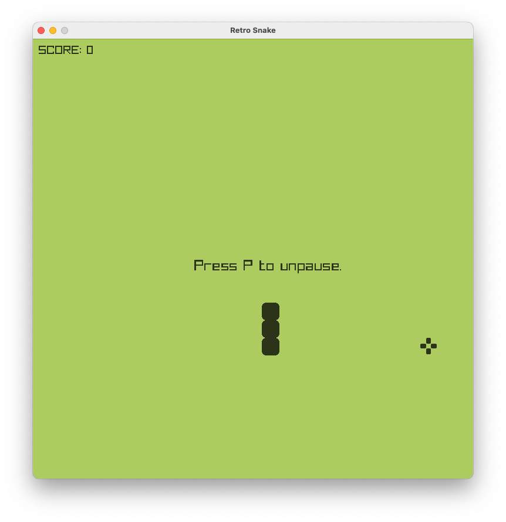
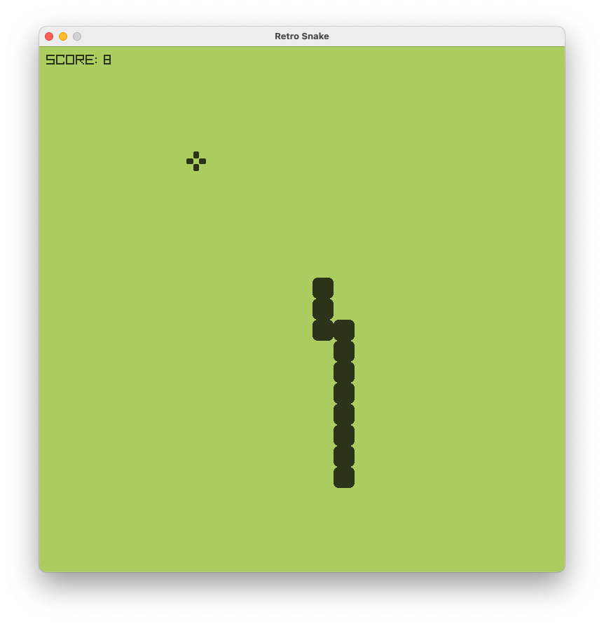

# Retro Snake Game

This is a retro-style snake game written in C++ using the raylib library. The game is a classic implementation of the popular snake game, where the player controls a snake that grows in length as it eats food, while avoiding colliding with the walls or its own tail.

## Screenshots




## Getting Started

To run the game, you will need to have the raylib library installed on your machine. Follow the instructions on the [raylib website](https://www.raylib.com) to install the library on your system.

Once you have raylib installed, clone this repository and navigate to the root directory. Run the following commands to compile and run the game:

```bash
$ g++ main.cpp `pkg-config --libs --cflags raylib` -o main
$ ./main.out
```

## Controls

- Use the arrow keys to control the direction of the snake.
- Press the 'P' key to pause the game.

Please make sure to update tests as appropriate.

## Gameplay

The objective of the game is to eat as much food as possible without colliding with the walls or the snake's own tail. Each time the snake eats a piece of food, its length increases by one.

The game ends when the snake collides with the walls or its own tail. Your score is displayed at the end of the game.

## Credits

This game was created by using the raylib library. The raylib library is developed by [Raylib Team](https://github.com/raysan5/raylib#development-and-contributors).
